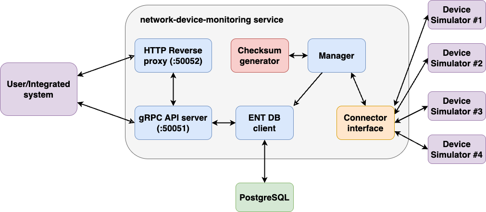
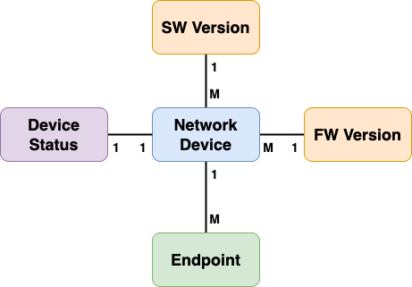

# Trade Show PoC
This is an assessment task for the Ubiquiti interview process.
[Here](./task_definition.md) is a task breakdown with my comments based on the PDF description. 
PDF itself is not shared within this repository.

## Development prerequisites
This repository is orchestrated with `Makefile`. You need to make sure that you have installed `helm` in your system
according to [official guidelines](https://helm.sh/docs/intro/install/) and that Golang and Docker are installed as well.
Also, make sure that you are able to run `make` within a command line. The rest of the dependencies are installed as a 
part of `make` targets.

> Run `make` or `make help` to see the full list of supported `make` targets.

To install development prerequisites, run `make deps`. It will install all necessary tools and plugins for code generation.
After that you can start the PoC by running `make poc`.
> You need to have [`helm` installed](https://helm.sh/docs/intro/install/) in your local environment.

## Running the demo
`make poc` target will setup a local Kubernetes cluster with KinD and deploy helm charts located in this repository to 
the cluster. You can also run `make poc-test` target, if you want to run helm tests (it is also a part of CI/CD).

> If `make poc` succeeds and doesn't throw an error, you can start interacting with the monitoring system.

There is a helper CLI utility that can be used to communicate with the `network-device-monitoring` service (see
project description below). 
Some handy wrappers with hardcoded data are created to make an easy onboarding and easy demonstration of system capabilities, 
see `make run-cli-*` targets. 

Before running cli commands (and any calls in general, please enable port-forwarding with `kubectl`. 
If you don't do so, requests won't reach the target. You can enable port-forwarding by running the following command,
which will forward port `50051`, where gRPC server of the `network-device-monitoring` service runs:
> kubectl -n monitoring-system port-forward <network-device-monitoring-POD-NAME> 50051:50051

Alternatively, you can enable port-forwarding on port `50052`, where HTTP reverse proxy resides. It will convert to
Protobuf and forward all your REST requests to the gRPC server. To enable port forwarding on port `50052` run:
> kubectl -n monitoring-system port-forward <network-device-monitoring-POD-NAME> 50052:50052

Consequently, you can use curl to test connectivity, e.g.:
> curl -v http://localhost:50052/v1/monitoring/summary
> 
> curl -v http://localhost:50052/v1/monitoring/devices

`make` targets contains only two aforementioned requests.

There is also a set of network device simulators deployed to the cluster to showcase the merits of the provided solution
and, mainly, ability to interact with network devices with different protocols.

> In the perfect world, where there is more time, I'd love to extend the solution with Grafana visualisation or other
> similar solutions.

## Solution
This section describes a provided solution. Following diagram represents relations within the components in the system.

Network Device Monitoring service consists of the following components:
- gRPC API server - autogenerated from Protobuf definition.
- HTTP Reverse proxy - autogenerated from Protobuf as well.
- ENT DB bindings - autogenerated from the same Protobuf.
- "External checksum generator" - just a mocked function embedded into code that produces SHA256 checksum out of a string with SW/FW version.
- Manager - a separate goroutine that fetches necessary data from devices (per specific interval) and stores them in DB.
- Connector interface - an abstraction that allows connectivity with devices over various protocols.
  - For the sake of simplicity, I've implemented pure gRPC connectivity under the hood (more in the 
  [device simulator section](pkg/mocks/README.md))).
- [Device simulator](pkg/mocks/README.md) is a Golang-based mock that returns hardcoded values. Return values can be 
parameterised through environmental values.

[Protobuf API definition](api/v1/monitoring.proto) is the main entry point to code generation. It defines gRPC and HTTP APIs
and resource definitions for the database schema (autogenerated with ENT plugin).

### Resource schema
Attribute-Based Access Control (ABAC) is solely programmatical and relates only to `Network Device` resource (the rest of 
the resources are created by the device monitoring's internal routines). Following attributes of the `Network Device` user/external entity
is allowed to set via gRPC/REST API:
- vendor
- model
- endpoints

All other attributes, i.e., HW, SW, FW versions and internal resource ID, are being set by the Network Device monitoring service.
Other resources - `Device Status` and `Version` - are created by Network Device monitoring service.

The following diagram breaks down relations between the resources.

Within the monitoring system, following states are defined for the network device:
- `UP` - device is up and running with no errors or issues reported.
- `UNHEALTHY` - device communicates but reports errors, issues.
- `DOWN` - network device doesn't communicate.

### External checksum binary
This has been vaguely defined. Implementation details can be found [here](pkg/checksum/README.md).

### Handling unstable network case
An explicit requirement was to handle the case when the network device is located on a site with a bad connection. A 
mixture of logging and retries was implemented to handle this scenario.
A threshold (in `CONNECTIVITY_ABSENCE_LIMIT`) is being set (default value is 3). For example, if the network device is 
unreachable (e.g., failed to establish connection or failed to retrieve information from the device)
**consequently/in a row** for a `CONNECTIVITY_ABSENCE_LIMIT` times (default is 3 times in a row), then the network 
device is considered to be in `DOWN` state. 

To track failed connectivity attempts an explicit field, `consequential_failed_connectivity_attempts` is defined in
`Device Status` resource. It is being incremented each time when the network device is unreachable, and being zeroed once 
device connectivity is established. Also, once this counter reaches the threshold value, `manager` reports the 
network device in `DOWN` state. 

This is managed within the `manager`'s control loop.

### API definition
For the API description you can refer to the description of `rpc` definitions in the [Protobuf](api/v1/monitoring.proto). 

## Testing
This section describes testing procedure. It is also assumed that `make poc` target was run successfully and didn't 
report any errors. At this point, you should have local Kubernetes cluster up and running with following microservices in
the `monitoring-system` namespace:
- `device-monitoring-postgresql-0`
- `device-monitoring-network-device-monitoring-*`
- `device-simulator-X`, where `X` is the number from 0 to 3 => 4 device simulators in total.

Following steps will guide you through the process of onboarding network devices to the system, retrieving theirs
status, simulating a change of the status to `UNHEALTHY` (and later to `DOWN`), and observing these changes within a system.

1. Enable port forwarding for gRPC connectivity as described in one of the previous sections.
2. Perform bulk onboarding of the network devices in the system.
   1. Run `make run-cli-add-devices` or `make run-cli-swap-devices`.
   2. CLI helper reads pre-defined data from the [config.json](./cmd/helper-cli/config.json) file.
      1. Four network devices with endpoints corresponding to the deployed device simulators are defined. 
   3. CLI wrapper runs set of `AddDevice` calls to create each device individually within a system.
3. `manager`s control loop reads device status each 30 seconds. Wait for one cycle and retrieve device statuses with
`make run-cli-get-all-statuses`. Alternatively, you can run `make run-cli-get-summary` to retrieve a brief summary 
of network devices.
   1. Another option is to run `curl -v http://localhost:50052/v1/monitoring/summary`, but you need to enable 
   port-forwarding on port `50052` prior to that.
4. All device simulators by default are configured to report `UP` state. To change the default value you need to change
value in line 16 of [values.yaml](./helm-charts/network-device-simulator/values.yaml) to `UNHEALTHY`.
5. Once you change the value, run `make deploy-device-monitoring` to refresh Device Simulator deployment.
6. Observe with `watch kubectl -n monitoring-system get pods` that all four device simulator pods are restarted and 
being in running state again.
7. Wait for another cycle (30 seconds) to let `manager`'s control loop to synchronize.
8. Run `make run-cli-get-all-statuses` or `make run-cli-get-summary` to retrieve fresh information about network devices.
  1. You should see that they all now in `UNHEALTHY` state.
9. Now, change again line 16 of [values.yaml](./helm-charts/network-device-simulator/values.yaml) to `DOWN`.
   1. This will push device simulator to return error on each connectivity attempt.
10. Now, `manager` will start counting number of times that the connection with network device failed to be established.
11. Run `make run-cli-get-all-statuses` to make sure that device statuses remained the same (i.e., in `UNHEALTHY` state).
12. Wait for approximately one more minute to let `manager`'s control loop perform its routine and reach threshold of 
consequent failed attempts to establish connection with the devices.
13. Run `make run-cli-get-all-statuses` to see that all network devices are right now reported with `DONW` state.

This is it!

## What can be done better
This section provides a brief discussion outlining what can be done better or differently in order to improve project.

ABAC access control to the resources should be better restricted. It can leverage of industry-adopted solutions like 
`rego` policy engine to better control which fields of the resource can be manipulated by whom:
- User can update only network device model, vendor, and endpoints.
- Controller itself can retrieve and update only network device HW, SW, FW, and device status.

> This is essential to avoid race conditions in systems with shared resources (like this one).

Other improvements should include:
- More sanity checks on the input data must be added at the API (gRPC server) side and at the DB client side.
  - Make use of `protoc-gen-validate` that is currently doing nothing.
- Make gRPC API more narrow - currently it carries redundant data in the responses. 
  - I was experimenting and found out that it is rather confusing. Unfortunately, I didn't have enough time to 
  bring it back to the normal state.
- Restrict HTTP Reverse proxy gateway (through Swagger definition of API) to set only specific fields of the resources, 
not all of them as it is handled right now (even though gRPC server will cut off everything unnecessary).
- Readyness and Liveness probes must be implemented to fully comply with the Kubernetes lifecycle.
- Improve unit test coverage.
  - Currently, unit tests cover only core functionality, majority of utility functions remained uncovered.
- Introduce integration tests.
  - Perfectly, make them part of CI/CD.
- Add deployment in Kubernetes (with helm charts) to CI/CD pipeline (partially done). 
  - One more helm test is missing (for network device monitoring service). The helm test for device simulator exists.

## Disclaimer
This section gives an honest opinion on the development process, in particular on the use of AI tools.

### Use of AI tools
AI tools were not used for any code generation, neither code completion, nor for coding instead of me. Somehow,
Gemini 2.5 Pro was used to make initial research in the best practices for handling:
- REST and gRPC API simultaneously.
    - Previous idea was to have two API Gateways - gRPC and REST one, but it's too much work.
    - Research indicated the existence of the `grpc-gateway` plugin, which is able to autogenerate reverse HTTP
      proxy out of the Protobuf schema definition (that is also used for ENT).
- SQL coexistance with Go code.
    - Research in tooling — rather misleading, unhelpful, and time-consuming.
    - I had to stick with my original idea to use `protoc-gen-ent` and `ent` framework for PostgreSQL interaction with
      microservice, which provided a central place for managing everything - API and SQL-driven schema within a single Protobuf.
- [Network Device simulator](pkg/mocks/README.md) advising.
  - Initially proposed some weird ideas that I did not understand. Main issue I had is that they were not relying on 
  actual connectivity. In the end, I've decided to stick to the current approach in  
  [Network Device simulator](pkg/mocks/README.md) that leverages solely of gRPC connectivity (for various protocols) 
  for the sake of simple testability.
- Little issues with the Kubernetes deployment, e.g., what is a better deployment model for the device simulator: 
  `statefulset` or `deployment` with `replicasCount` or something else, and few other small bugs (mostly FQDN-related).

I also found some recommendations about different tool usage confusing and misleading rather than helpful.
It's always better to follow tool's documentation rather than asking AI for a tutorial.

### Silly, nasty bugs
This project has been evolving rapidly fast, under the short time constraints. There might be some silly, little, and
tricky corner cases that I didn't take into account. Overall, the general workflow should be safe from violations. 
In case you found a bug, feel free to submit an issue with a detailed description. 
