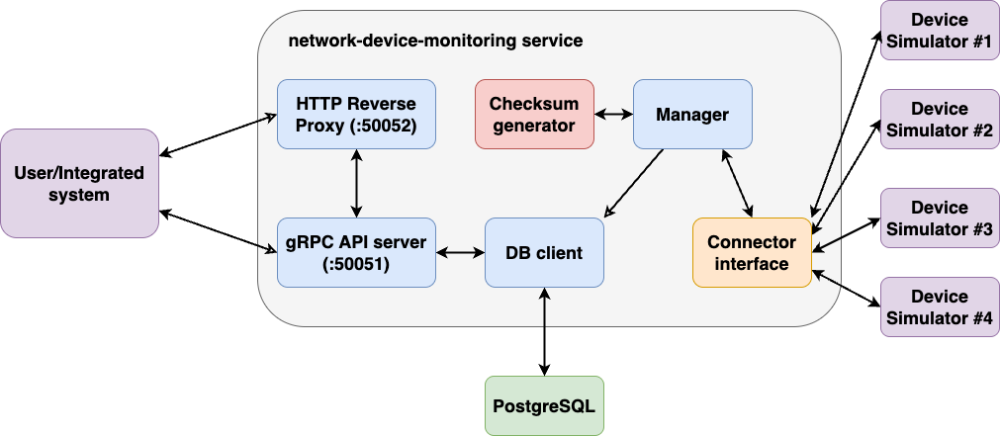

# Trade Show PoC
This is an assessment task for the Ubiquiti interview process.
[Here](./task_definition.md) is a task breakdown with my comments based on the PDF description. 
PDF itself is not shared within this repository.

## Development prerequisites
This repository is orchestrated with `Makefile`. You need to make sure that you have installed `helm` in your system
according to [official guidelines](https://helm.sh/docs/intro/install/) and that Golang and Docker are installed as well.
Also, make sure that you are able to run `make` within a command line. The rest of the dependencies are installed as a 
part of `make` targets.

> Run `make` or `make help` to see the full list of supported `make` targets.

To install development prerequisites, run `make deps`. It will install all necessary tools and plugins for code generation.
After that you can start the PoC by running `make poc`.
> You need to have [`helm` installed](https://helm.sh/docs/intro/install/) in your local environment.

## Running the demo
`make poc` target will setup a local Kubernetes cluster with KinD and deploy helm charts located in this repository to 
the cluster. You can also run `make poc-test` target, if you want to run helm tests (it is also a part of CI/CD).

> If `make poc` succeeds and doesn't throw an error, you can start interacting with the monitoring system.

There is a helper CLI utility that can be used to communicate with the `network-device-monitoring` service (see
project description below). 
Some handy wrappers with hardcoded data are created to make an easy onboarding and easy demonstration of system capabilities, 
see `make run-cli-*` targets. 

Before running cli commands (and any calls in general, please enable port-forwarding with `kubectl`. 
If you don't do so, requests won't reach the target. You can enable port-forwarding by running the following command,
which will forward port `50051`, where gRPC server of the `network-device-monitoring` service runs:
> kubectl -n monitoring-system port-forward <network-device-monitoring-POD-NAME> 50051:50051

Alternatively, you can enable port-forwarding on port `50052`, where HTTP reverse proxy resides. It will convert to
Protobuf and forward all your REST requests to the gRPC server. To enable port forwarding on port `50052` run:
> kubectl -n monitoring-system port-forward <network-device-monitoring-POD-NAME> 50052:50052

Consequently, you can use curl to test connectivity, e.g.:
> curl -v http://localhost:50052/v1/monitoring/summary
> 
> curl -v http://localhost:50052/v1/monitoring/devices

`make` targets contains only two aforementioned requests.

There is also a set of network device simulators deployed to the cluster to showcase the merits of the provided solution
and, mainly, ability to interact with network devices with different protocols.

> In the perfect world, where there is more time, I'd love to extend the solution with Grafana visualisation or other
> similar solutions.

## Solution
This section describes a provided solution. Following diagram represents relations within the components in the system.

For the devices on sites with bad connectivity, a threshold (in `CONNECTIVITY_ABSENCE_LIMIT`) is defined. For example,
if network device was unreachable (e.g., failed to establish connection or failed to retrieve information from the device)
**consequently** for `CONNECTIVITY_ABSENCE_LIMIT` times, then network device is considered to be in down state.
This is managed within main control loop.

## Testing
This section describes testing procedure.

For more information on how external checksum generator was embedded to the monitoring service, please refer to 
[this](pkg/checksum/README.md) README.

## What can be done better
ABAC access control to the resources should be implemented to better restrict access to the fields of the resources 
in the data schema, namely:
- User can update only network device model, vendor, and endpoints.
- Controller itself can retrieve and update only network device HW, SW, FW, and device status.

Other improvements include:
- More sanity checks on the input data must be added at the API (gRPC server) side and at the DB client side.
  - Make use of `protoc-gen-validate` that is currently doing nothing.
- Make NB API more narrow - currently it carries some redundant data in response (my experiment didn't work out :).
- Readyness and Liveness probes must be implemented to fully comply with Kubernetes lifecycle.
- Improve unit test coverage.
  - Currently, unit tests cover only core functionality, majority of utility functions remained uncovered.
- Introduce integration tests.
  - Perfectly, make them part of CI/CD.
- Add deployment in Kubernetes (with helm charts) to CI/CD pipeline. 
  - One more helm test is missing (for monitoring service). Test for device simulator exists.

## Disclaimer
This section gives an honest opinion on the development process, in particular on the use of AI tools.

### Use of AI tools
AI tools were not used for any code generation neither code completion nor for coding instead of me. Somehow,
Gemini 2.5 Pro was used to make initial research in best practices for handling:
- REST and gRPC API simultaneously.
    - Previous idea was to have two API Gateways - gRPC and REST one, but too much work.
    - Research indicated the existence of the `grpc-gateway` plugin, which is able to autogenerate rever HTTP
      proxy out of Protobuf definition of the schema.
- SQL coexistance with Go code.
    - Research in tooling — rather misleading, unhelpful, and time-consuming.
    - I had to stick with my original idea to use `protoc-gen-ent` and `ent` framework for PostgreSQL interaction with
      microservice, which provided a central place for managing everything - API and SQL-driven schema within a single Protobuf.
- [Network Device simulator](pkg/mocks/README.md) advising.
  - Initially proposed some weird ideas that I did not understand. Main issue I had is that they were not relying on 
  actual connectivity. In the end, I've decided to stick to the current approach in 
  [Network Device simulator](pkg/mocks/README.md) that
  leverages solely of gRPC connectivity (for various protocols) for the sake of simple testability.
- Consulted little issues with deployment, e.g., what is a better deployment model for device simulator: 
  `statefulset` or `deployment` with `replicasCount`, and few other small bugs (mostly FQDN-related).

I also found some recommendations about different tool usage confusing and misleading rather than helpful.
It's always better to follow tool's documentation rather than asking AI for a tutorial.

### Silly, nasty bugs
This project has been evolving rapidly fast, under the short time constraints. There might be some little tricky corner 
cases that I didn't take into account. Overall, the general workflow should be safe from violations. In case you found a bug,
feel free to submit an issue with a detailed description. 
